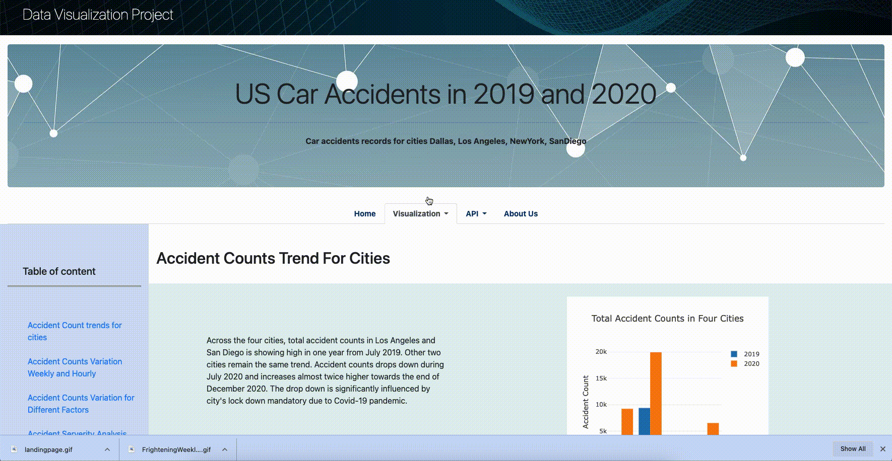

# US Car Accidents In 2019 and 2020
## Car accident records for Dallas, Los Angeles, New York and San Diego


 

###### [source: https://gfycat.com/](https://gfycat.com/glumwastefuladouri)


### Submission: 

Presentation slides: [slides](https://docs.google.com/presentation/d/1dNHoc9JetdCnhF4Lqx8kSG29F1tTuZt0xexHgTMyiwc/edit#slide=id.p1)

Project proposal: [proposal](https://docs.google.com/document/d/1yoNl9GCSNnPkJ3Czj6JOwN5cLzYu0_CJZqXyIYiRr3A/edit)

Project report: [report](https://docs.google.com/document/d/1GPZVrbWKufxIr1vfOhEgYI767lqN5ignn-ufTtXSf1g/edit)

## Introduction

Road accidents have become very common these days. Nearly 1.25 million people die in road crashes each year, on average, 3,287 deaths a day. Moreover, 20–50 million people are injured or disabled annually.

## Motivation

Reducing traffic accidents is an essential public safety challenge all over the world., therefore accident analysis is subject of much research. Since we had the data up till 2020, our team was curious to analyze considering 2020 was global lockdown period.

## Objective of the Analysis:

The purpose of this analysis is to answer the following questions: 

* Which states and cities of the 4 have most traffic accidents?
* What is the time of the day, the day of the week and the month with the higher number of accidents?
* How many accidents over the two years? 
* What are the most common weather conditions on the days of the accidents?
* How many accidents have a severity level of 1, 2, 3 and 4? and what could be the factors?

This analysis can be used by authorities to study car accidents hotspot locations and prevent accidents in the future by taking some preventive measures.

## Findings & Conclusion:

After the analysis, we found the following:

* LA top the charts.!
* Mondays and Fridays between 12 to 6pm has most count. December has seen highest rate.
* Surprisingly 2020 tops the charts, considering it was the pandemic year with lockdown.
* Most accidents were caused on a moderately fair day. Also, most accidents happened at junction and traffic signals. 
* Most Accidents have severity level -2 which means there were minor injuries, 4 being the fatal.


## About the data: 

* We acquired data from Kaggle. This is a country wide car accident dataset which covers 49 states of the USA.  The data are collected from 2016 to 2020. There are about 1.5 million accident records in this dataset. However our team concentrated on the data of past 2 years and select cities due to huge volume.
* US Traffic Accidents Data Analysis for the year 2019 – 2020
* Cities Selected : New York,Dallas (TX),Los Angeles, San Diego (CA)
* Source : https://www.kaggle.com/sobhanmoosavi/us-accidents


## Work flow of the Project: 

We used the following workflow to create our final web page.


## Extraction – Transformation – Load:


* We downloaded the inital raw data as `CSV` file from [Data source](https://www.kaggle.com/sobhanmoosavi/us-accidents). Due to the size of the file (569.1 MB), which is over GitHub allowance. This time we couldn't be able to include the file in this repository.
* Data extraction and cleaning were carried out using Pandas in a Jupyter notebook called [`USAccidentsETL.ipynb`](https://github.com/KeSavanh/Project_3/blob/main/Project_3_ver1/USAccidentsETL.ipynb). As mentioned earlier the initial CSV file () is not included, in order to run this extraction process, `US_Accidents_Dec20_updated.csv` needs to be downloaded from the source above.

* The cleaning process included: 
    * Identifying and droping Null values,
    * Changing the datatype of important columns (Date/Time),
    * Filtered the data to select cities

* After the cleaning process, for further analysis, there are two `CSV` files created: [`USAccidents_Clean.csv`](https://github.com/KeSavanh/Project_3/blob/main/Project_3_ver1/USAccidents_Clean.csv) and [`WeatherData.csv`](https://github.com/KeSavanh/Project_3/blob/main/Project_3_ver1/WeatherData.csv) which we extracted catagorical data seperately in this file. 

* Then the cleaned dataframes is loaded to SQLite database as processed in this Jupyter notebook [`Cleaned_data.ipynb`](https://github.com/KeSavanh/Project_3/blob/main/Project_3_ver1/Cleaned_data.ipynb). In there, the functions commented out in line `[25]` and `[26]` are to delete the existing tables, and those need to be excuted before creating the new tables. 
```
In [25] : #conn.execute("DROP TABLE us_accidents ")
```
```
In [26] : #conn.execute("DROP TABLE us_weather ")
```

The next step we created a Python [`app.py`](https://github.com/KeSavanh/Project_3/blob/main/Project_3_ver1/app.py), to generate `Json` formate files based on data queried from our tables in database. and below shows how our [`app.py`](https://github.com/KeSavanh/Project_3/blob/main/Project_3_ver1/app.py) function looks like: 

### FLASK – API route generation:

```
@app.route("/year/data")

def yearlyaccidents():
    # read query parans
    args = request.args
    year = args["year"]
    city = args["city"]

    session = Session(bind=engine)

    sel = (USAccidents.Year, USAccidents.City, USAccidents.State, USAccidents.Street, USAccidents.Start_Lat, USAccidents.Start_Lng,
           USAccidents.Severity, USAccidents.Weather_Condition, USAccidents.Accident_id)

    if (year and city):
        results = session.query(
            *sel).filter(USAccidents.Year == year, USAccidents.City == city).all()
    else:
        results = session.query(*sel).all()

    session.close()

    response = []

    for item in results:
        response.append(
            {"year": item[0],
                "city": item[1],
                "state": item[2],
                "street": item[3],
                "lat": item[4],
                "lng": item[5],
                "severity": item[6],
                "weather_condition": item[7],
                "accident_id": item[8]
             }
        )
    return jsonify(response)

```

This shows how our Json file looks like:

### JSON Response:

```
[
  {
    "accidents_count": 1560, 
    "city": "Dallas", 
    "year": 2019
  }, 
  {
    "accidents_count": 9380, 
    "city": "Los Angeles", 
    "year": 2019
  }, 
  {
    "accidents_count": 447, 
    "city": "New York", 
    "year": 2019
  }, 
  {
    "accidents_count": 3516, 
    "city": "San Diego", 
    "year": 2019
  }, 
  {
    "accidents_count": 9223, 
    "city": "Dallas", 
    "year": 2020
  }, 
  {
    "accidents_count": 19930, 
    "city": "Los Angeles", 
    "year": 2020
  }, 
  {
    "accidents_count": 2104, 
    "city": "New York", 
    "year": 2020
  }, 
  {
    "accidents_count": 6530, 
    "city": "San Diego", 
    "year": 2020
  }
]

```


## Visualization:

Here are the final html pages power up by python flask app.

### Langding page:


### Visualization pages:


### API page:



### About Us page: 


## Acknowledgments:

* Moosavi, Sobhan, Mohammad Hossein Samavatian, Srinivasan Parthasarathy, and Rajiv Ramnath. <a href="https://arxiv.org/abs/1906.05409">“A Countrywide Traffic Accident Dataset.”</a> , arXiv preprint arXiv:1906.05409 (2019).
* Moosavi, Sobhan, Mohammad Hossein Samavatian, Srinivasan Parthasarathy, Radu Teodorescu, and Rajiv Ramnath. <a href="https://arxiv.org/abs/1909.09638">“Accident Risk Prediction based on Heterogeneous Sparse Data: New Dataset and Insights.”</a> In proceedings of the 27th ACM SIGSPATIAL International Conference on Advances in Geographic Information Systems, ACM, 2019.


## Team member: 

* Tamasree Sinha
* Hima V
* Lekshmi Prabha
* Vilaysack Khonsavanh


